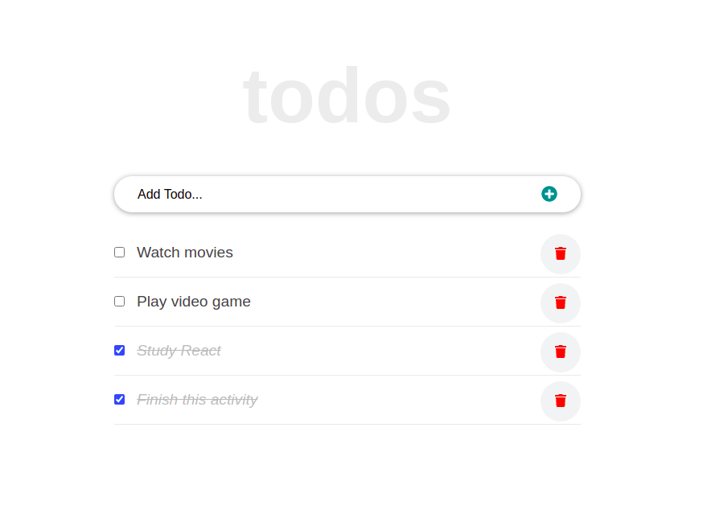

# to-do-app-react

> React Tutorial to strengthen the knowledge in React

The objective of this tutorial exercise was to learn more about React Events, Hooks and Router. 

## Built With

- JavaScript/React
- React Events
- React Hooks
- React Routing
- JSX
- CSS
- VSCode
- Webpack
- Babel
- Ubuntu 20.04
- Linters

## Setup

- Get the link of the repository: `git@github.com:arthurborgesdev/to-do-app-react.git`
- Clone it as `git clone git@github.com:arthurborgesdev/to-do-app-react.git` on a Terminal

## Usage

- Run `npm install` on a Terminal to install the modules
- Run `yarn start` on a Terminal to start the server 
- Open [http://localhost:3000](http://localhost:3000) to view it in the browser.

## Author

👤 **Arthur Borges**

- GitHub: [@arthuborgesdev](https://github.com/arthurborgesdev)
- Twitter: [@arthurmoises](https://twitter.com/arthurmoises)
- LinkedIn: [Arthur Borges](https://linkedin.com/in/arthurmoises)

## 🤝 Contributing

Contributions, issues, and feature requests are welcome!

## Show your support

Give a ⭐️ if you like this project!

## Acknowledgments

- Microverse
- React documentation
- [React-tutorial-for-beginners](https://ibaslogic.com/react-tutorial-for-beginners/)
- Lots and lots of Stack Overflow questions and answers